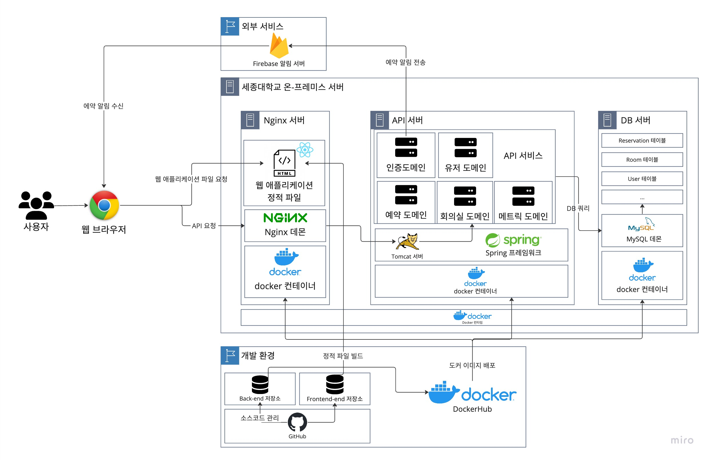

# 세종대 2023 캡스톤: 회의실 예약 시스템 백엔드

## 서버 배포

### 서버 배포 가이드

1. Jib를 이용하여 Docker 이미지 생성 및 DockerHub에 업로드
```bash
gradle jib --image=[DOCKERHUB_ACCOUNT]/sju-capstone-room-reservation-server
```

2. 서버에 접속

```bash
ssh capstone6@211.180.114.56
```

3. MySQL docker container 실행

```bash
docker run --name capstone6-mysql -e MYSQL_ROOT_PASSWORD=[ROOT_PASSWORD] -d -p 3306:3306 mysql
```

4. MySQL 로그인 후 DB 셋업

셋업: Spring Batch 사용을 위해서는 DB에 spring batch metadata table들을 생성해야 함.
해당 링크에서 schema를 복사하여 DB에 적용: [schema-mysql.sql](https://github.com/spring-projects/spring-batch/blob/main/spring-batch-core/src/main/resources/org/springframework/batch/core/schema-mysql.sql)

```bash
docker cp ./schema-mysql.sql capstone6-mysql:/home/

docker exec -it capstone6-mysql mysql -u root -p
```

```sql
CREATE DATABASE capstone;
CREATE USER 'capstone6'@'%' IDENTIFIED BY 'capstone6';
GRANT ALL PRIVILEGES ON capstone.* TO 'capstone6'@'%';
FLUSH PRIVILEGES;

USE capstone;
SOURCE /home/schema-mysql.sql;
```

5. API 서버 실행

```bash
docker run --name capstone6-apiserver -d -p 8080:8080 --link capstone6-mysql:mysql [DOCKERHUB_ACCOUNT]/sju-capstone-room-reservation-server
```

6. Nginx 서버 실행

```bash
docker run --name capstone6-nginx -d -p 80:80 --link capstone6-apiserver:wlghks0314/sju-capstone-room-reservation-server -v $(pwd)/nginx:/etc/nginx/conf.d nginx
```

### 서버 접속 가이드



인프라는 다음과 같이 Nginx 서버 -> API 서버 -> MySQL(DB) docker 컨테이너들로 이루어져 있음.

Nginx 서버는 앞단에서 다음과 같은 역할을 수행함.

- API 서버로 요청을 전달 (백엔드 API): `http://{SERVER_IP}/api/...`로 요청을 보내면 API 서버로 전달됨
- 정적 페이지 서빙 (프론트엔드 웹앱): `http://{SERVER_IP}/`로 요청을 보내면 프론트엔드 웹앱을 다운받을 수 있음.

사용자는 브라우저를 통해 `http://{SERVER_IP}/`로 웹페이지(웹앱)를 요청하고, 웹앱에서 `http://{SERVER_IP}/api/...`로 API 서버로 요청을 보내게 됨.